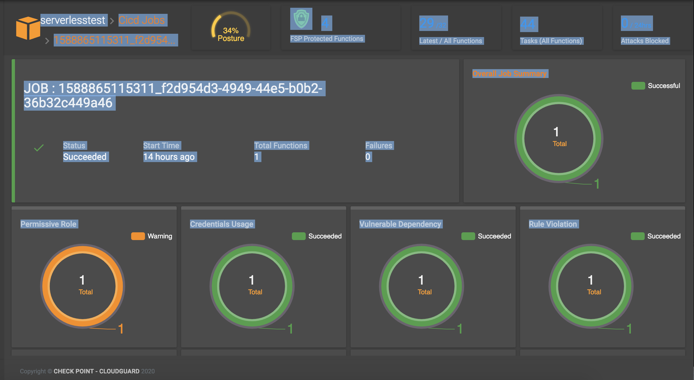

# Check Point CloudGuard Workload CICD Security:

## CloudGuard Workload Serverless CICD pipeline with SAST/DAST Security

Deploying serverless Lambda functions on AWS using a Serverless Framework CICD pipeline with the Check Point CloudGuard Workload solution for serverless Build and Runtime security,
Serverless Framework allows you to build, test and deploy serverless functions from your local machine to the cloud. 
Here i am buidling a simple web node.js serverless funtion and adding the Check Point CloudGuard Workload plugin to add proact plugin for SAST and FSP(Function Self Protection) for DAST or Runtime security. 
SAST is the scanning of of the function source code while the runtime security whitelists a function behavior.

Started a Serverless project called lamdba-cicd which will create a dir with the same name and will generate a serverless.yaml file. I have created a github repo to be used as SCM,

#### Please install the following before starting the lab:

```

Node.js
AWS credentials (Install AWS CLI v2 on local machine and add credentials and region during the CLI installation)
Git
Docker
The Serverless Framework (using Open Source)
https://www.serverless.com/framework/docs/providers/aws/

```

Installing the Serverless Framwework will create a project directory where serverless.yml and handler.js files will be automatically generated. the serverless.yml file contains the config and the handler.js the application source code to be packaged as a lambda fucntion.
Please change dir to the Serverless project directory where your serverless.yml file is located and install the Dome9 Cloudguard workload plugin

> npm install -D https://artifactory.app.protego.io/cloudguard-serverless-plugin.tgz

Get the Dome9 CloudGuard workload Token and create a protego-config.json file as follow. Place this file in the same dir as your serverless.yml file in the serverless project dir.

```
{
    "protegoAccessToken": "DOME9-ACCESS-TOKEN"
}

```

The CloudGuard plugin is added to the serverless.yaml file using the followin syntax:
This can be added at the global level before all function definition to apply to all functions or per function within the function section. In my case I am doing this at the global level

```

plugins:
 - serverless-cloudguard-plugin

custom:
  protego:
    fsp:
      Enabled: true
    proact:
      Enabled: true
           
      StoreJobReport: true                         # default is false

      Features:
        PermissiveRole:
          Enabled:        true                     # default is true
          FailThreshold:   None                    # default is None

        VulnerableDependency:
          Enabled:        true                     # default is true
          FailThreshold:  Critical                 # default is None

        CredentialsUsage:
          Enabled:        true                     # default is true
          FailThreshold:  None                     # default is None

        RuleViolation:
          Enabled:        true                    # default is true
          FailThreshold:  None                    # default is None
      
```

You can chose to use any function runtime and code and that is store in the handler.js file under the serverless rpoject directory

##### For this test, I am using a simple node.js function as follow but could be anything and you can also include other serverless dependencies such API GW, S3 bucket, Cognito, DynamoDB etc.. depending on the application you are deploying.

```
$cat handler.js
'use strict';

module.exports.cgtest = async event => {
  return {
    statusCode: 200,
    body: JSON.stringify(
      {
        message: 'Go CloudGuard WorkLoad.. Your function has been secured successfully!',
        input: event,
      },
      null,
      2
    ),
  };
};

```
#### For the CICD Job, I am using GitHub as the SCM repository by adding my serverless project local directory to Git with the following commands:

> git init
> git add -A
> git commit -m 'lambda-cicd'
> git remote add origin git@github.com:chkp-dhouari/lambda-cicd-security.git
> git push -u -f origin master

Note: You can configure WebHooks with Github to trigger a CICD Jobs when doing changes.

#### The CICD job is started using the <sls deploy> command and we can see the proact and fsp performing the code scanning and adding the runtime security layer to the Lambda function.

```

dean:lambda-cicd dasig$ sls deploy
Serverless: [serverless-plugin-cloudguard: fsp] FSP:: loadDependencies 
Serverless: [serverless-plugin-cloudguard: fsp] Initializing... 
Serverless: [serverless-plugin-cloudguard: fsp] Initializing, Done. 
Serverless: [serverless-plugin-cloudguard: proact] Initializing... 
Serverless: [serverless-plugin-cloudguard: proact]  - Initializing docker (protego/protego-runtime:latest) - please wait, this action may take some time ... 
Serverless: [serverless-plugin-cloudguard: proact] Initializing, Done. 
Serverless: Packaging service...
Serverless: Excluding development dependencies...
Serverless: [serverless-plugin-cloudguard: proact]  | --- Scanning --- | please wait, this action may take some time ... 

λ: (✓) hello
-----------------------------------
	PermissiveRole : Warning (Low) - Role Too Permissive     
	VulnerableDependency : Succeeded
	CredentialsUsage : Succeeded
	RuleViolation : Succeeded
Detailed output: protego_output/hello.yaml
-----------------------------------

Number of failed functions: 0
Scan detailed output: file:////Users/dasig/lambda-cicd/protego_output/ProtegoScanResults.yaml
Scan detailed report (HTML): file:////Users/dasig/lambda-cicd/protego_output/ProtegoScanReport.html


--------------------------------------------------------
 Stored Job Id: 1588863622893_04a5ea19-d737-4cb9-bbf5-38943d860637
--------------------------------------------------------

Serverless: [serverless-plugin-cloudguard] * Adding layer to hello (nodejs12.x) ... 
Serverless: [serverless-plugin-cloudguard] Validate Packages 
Serverless: Uploading CloudFormation file to S3...
Serverless: Uploading artifacts...
Serverless: Uploading service lambda-cicd.zip file to S3 (405.81 KB)...
Serverless: Validating template...
Serverless: Updating Stack...
Serverless: Checking Stack update progress...
.........
Serverless: Stack update finished...
Service Information
service: lambda-cicd
stage: dev
region: us-east-1
stack: lambda-cicd-dev
resources: 8
api keys:
  None
endpoints:
  None
functions:
  hello: lambda-cicd-dev-hello
Serverless: 
Protego - FSP Plugin (1.4.25) Summary:

  Protected Functions:
    ✓ hello:  Protected (.serverless/lambda-cicd.zip)   <<<<<<<<<<======= FSP (Runtime Security)

Serverless: 

======================================================
|               DEPRECATION WARNING!!!               |
======================================================
WARN: serverless-protego-plugin plugin will be deprecated in coming releases.
Use serverless-cloudguard-plugin plugin instead.
Please refer to the product documentation for more details.

layers:
  None
Serverless: Publishing service to the Serverless Dashboard...
Serverless: Successfully published your service to the Serverless Dashboard: https://dashboard.serverless.com/tenants/deanj08/applications/lambda-cicd-app/services/lambda-cicd/stage/dev/region/us-east-1
dean:lambda-cicd dasig$


```

#### The CICD Jobs can be managed from CloudGuard Workload for more details:


 


 

